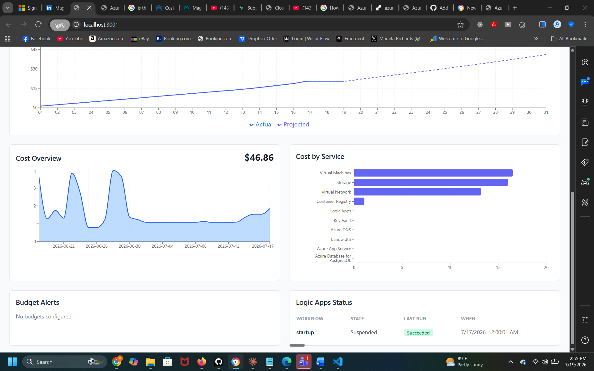
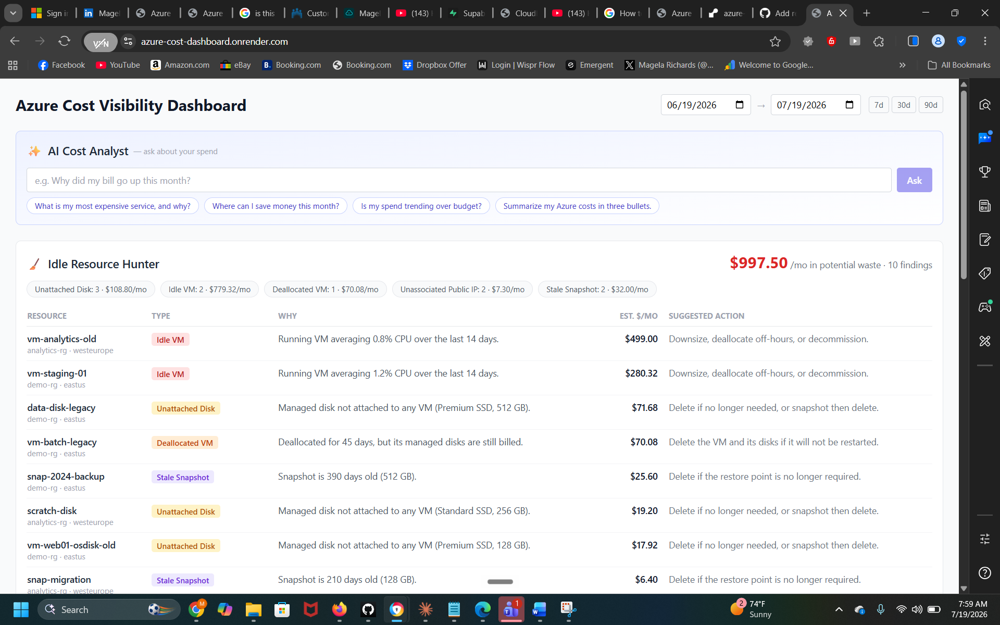
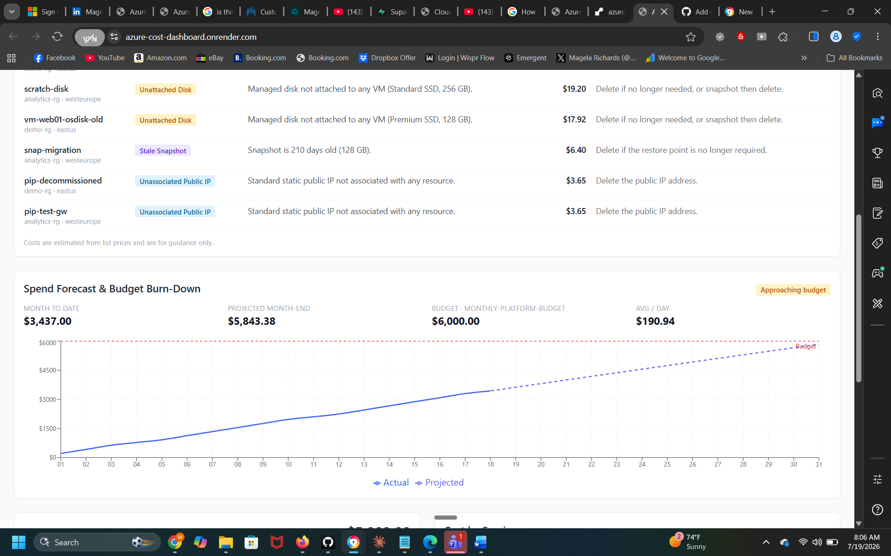
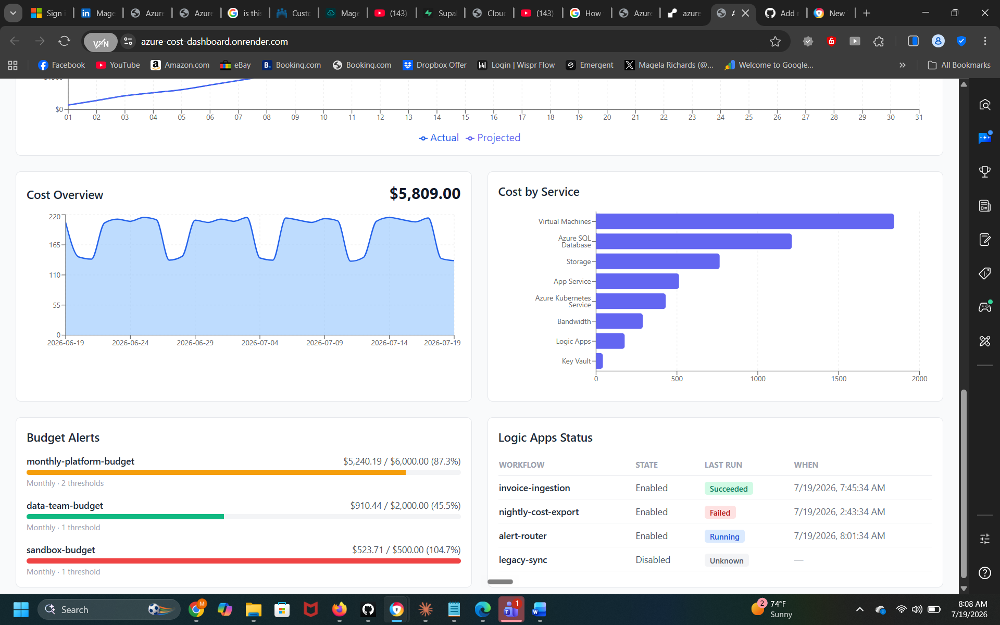

# Azure Cost Visibility Dashboard

## Overview
A full-stack dashboard for visualizing **Azure spend**, budget alerts, resource utilization, and Logic App workflow status. The backend uses **Node.js/Express** to query Azure’s management APIs, while a **React + Tailwind** frontend renders interactive charts and dashboards. The platform includes AI-powered cost analysis and an Idle Resource Hunter for cost optimization.
## Live Demo

Check out the running dashboard here:  
**[https://azure-cost-dashboard.onrender.com/](https://azure-cost-dashboard.onrender.com/)**

## 📸 Screenshots

| Cost Overview & By Service | Idle Resource Hunter |
| :---: | :---: |
|  |  |
| **Spend Forecast & Budget Burn-Down** | **Budget Alerts** |
|  |  |

## Problem Statement
Cloud cost overruns and lack of visibility threatened financial control for Azure workloads:
- No consolidated dashboard for spend or budgets
- Manual tracking of idle resources and workflow health
- No automated insights or AI-driven cost-saving recommendations

## Features
- **Cost overview & by-service:** Daily spend trends and per-service breakdown (Recharts)
- **Forecasting & budget burn-down:** Month-end spend projection vs. budget
- **Budget alerts:** Progress bars and notifications from Azure Consumption API
- **Logic Apps status:** Real-time workflow health and run history
- **✨ AI Cost Analyst:** Natural language cost analysis with Anthropic’s Claude model
- **🧹 Idle Resource Hunter:** Detects and estimates waste from unattached disks, idle VMs, stale snapshots, and more, with actionable recommendations

## Tech Stack

| Layer      | Technology                                                                 |
|------------|----------------------------------------------------------------------------|
| Backend    | Node.js, Express                                                           |
| Frontend   | React, Tailwind CSS, Recharts, Vite                                        |
| Azure      | @azure/arm-costmanagement, @azure/arm-consumption, @azure/arm-monitor,     |
|            | @azure/arm-logic, @azure/arm-compute, @azure/arm-network, @azure/identity  |
| AI         | @anthropic-ai/sdk (Claude) – powers the AI Cost Analyst                    |
| Auth       | DefaultAzureCredential (env vars, managed identity, Azure CLI login)        |

## Prerequisites
- **Node.js 18+**
- **Azure subscription** with cost data
- **IAM roles:** Cost Management Reader, Monitoring Reader, Logic Apps Contributor, Reader
- **Azure CLI** (`az login`) or service principal credentials
- (For mock mode: no Azure credentials required)

## Project Structure

## Setup

1. **Clone the repo:**

2. **Install dependencies (root + backend + frontend):**

3. **Configure environment:**

## Running

### Mock mode (no Azure credentials required)
- Run backend with demo data:
- In a separate terminal, run frontend:

### Real Azure mode
- Fill in backend/.env with Azure creds and set `MOCK_DATA=false`
- Start both apps:

## Deployment

- **Docker Compose:**
- **Docker:**
- **Azure (Terraform):**  
See `terraform/README.md` for full cloud deployment instructions.

## Authentication
- Set `AUTH_USER` and `AUTH_PASSWORD` for HTTP Basic Auth on all endpoints.
- Always run behind HTTPS in production for secure credential transmission.

## API Endpoints

| Method | Path                    | Description                                            |
|--------|-------------------------|--------------------------------------------------------|
| GET    | /api/health             | Health check                                           |
| GET    | /api/costs/overview     | Total spend / daily trend                              |
| GET    | /api/costs/by-service   | Spend grouped by service                               |
| GET    | /api/alerts             | Budget alerts                                          |
| GET    | /api/costs/forecast     | Spend projection & budget burn-down                    |
| GET    | /api/logicapps          | Logic App workflow status                              |
| POST   | /api/analyst/ask        | AI Cost Analyst — ask questions in plain English       |
| GET    | /api/idle               | Idle/orphaned resources and estimated waste            |

## Value Delivered
- **Centralized, real-time Azure cost visibility**
- **AI-powered recommendations** for cost savings
- **Automated detection of idle resources and spend anomalies**
- **Ready-to-use dashboards** for finance, engineering, and cloud teams
## Resume Highlights

- **Azure Cost Dashboard:** Built and deployed dashboards in Azure Monitor Workbooks using Cost Management APIs for real-time, tag-based spend visibility
- **FinOps Cost Reduction:** Reduced Azure costs by 20% ($1,000/year) through VM right-sizing audits and automated scheduling
- **Process Automation:** Automated VM power-scheduling and backup verification with PowerShell, saving 10–15 hours/week

## Author
**Magela Bobby Akinola**  
[LinkedIn](https://linkedin.com/in/magela-akinola) | [Portfolio](https://magela84.github.io/magela-portfolio-website/) | [GitHub](https://github.com/Magela84)
