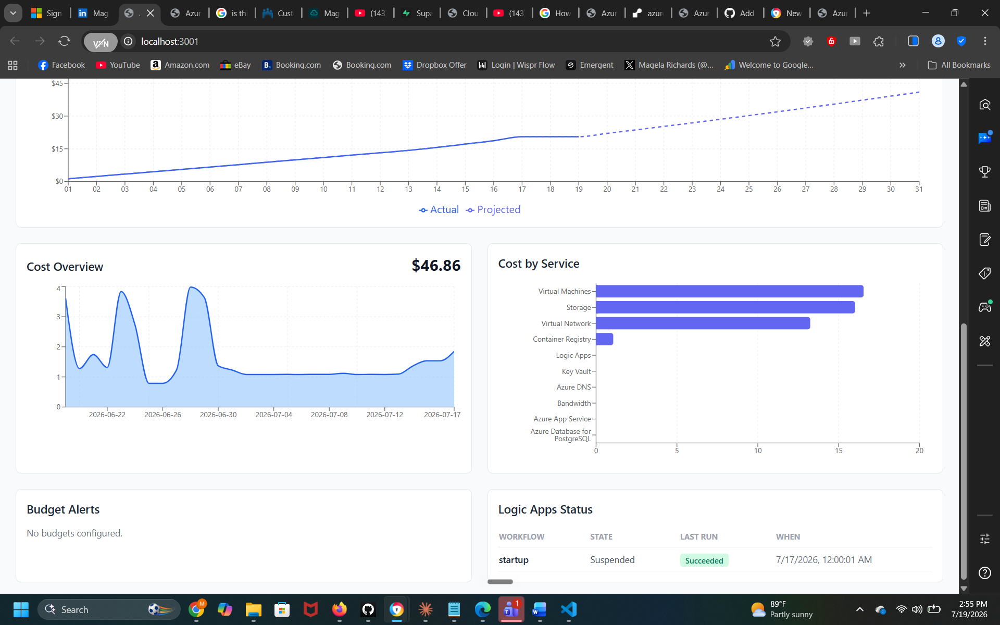
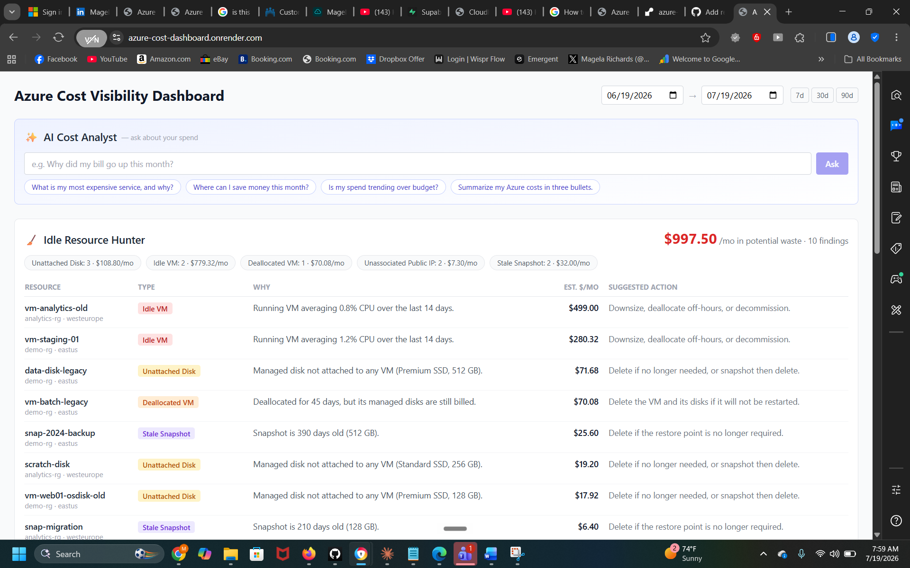
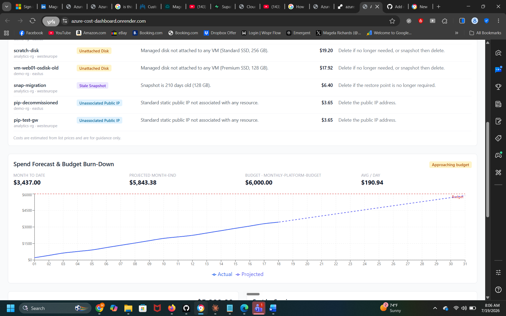
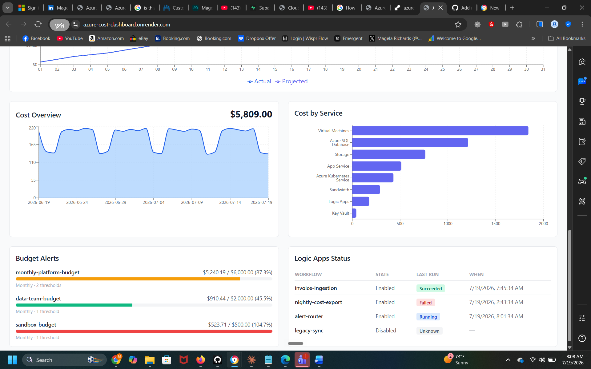

# Azure Cost Visibility Dashboard

## Industry Relevance

Designed for **finance, healthcare, insurance, and e-commerce**, this enterprise-ready dashboard delivers **real-time Azure cost visibility**, **AI-powered spend optimization**, and **automated resource intelligence**—helping organizations improve governance, reduce cloud waste, and maintain compliance.

---

## Project Overview

I built an Azure Cost Automation Dashboard to give stakeholders visibility into Azure spend, spot idle or underutilized resources, and support cost optimization decisions.

---

## Key skills demonstrated

Azure Functions App, React, Microsoft Entra ID, Managed identity, Azure RBAC, Azure Cost Management API, serverless computing, authentication and authorization, Azure cost optimization.

## Architecture

React dashboard to function app to managed identity, to Entra ID, to Azure Cost Management API, back to function, then architecture diagram.

https://lucid.app/lucidchart/7d7c17ac-4202-44aa-afe0-dbc4aeb47d5d/edit?viewport_loc=-1317%2C-2413%2C1625%2C907%2C0_0&invitationId=inv_1d8a5ba5-6895-4cd6-a878-c24b69168604
---

## Screenshots

| Cost Overview | Idle Resource Hunter |
|:-------------:|:--------------------:|
|  |  |

| Forecasting | Budget Alerts |
|:-----------:|:-------------:|
|  |  |

---

##  Business Problem

The business was facing increasing Azure costs because stakeholders lacked centralized visibility into Azure spend.
---

## Solution
I built a React frontend with an Azure Function backend that securely retrieves, processes, and presents cost data. 

### Business Value
React, Azure Function App, Microsoft Entra ID, managed identity, Azure RBAC, Azure Cost Management API.

---

### 3. Technology stack

React, Azure Function App, Microsoft Entra ID, managed identity, Azure RBAC, Azure Cost Management API.

### 4. Data flow

The React dashboard sends a request, the function app uses managed identity authenticates through Entra ID for an access token, Entra ID issues access token Function app uses access token to securely calls the Azure cost management API, The API checks RBAC permissions If authorized, the API returns the raw cost data to the function app. processes and formats the data, returns clean results to the dashboard. 
---

## Cloud Security
Managed identity removes store secrets. Entra ID authenticates and issues a token, RBAC enforces least privilege read-only access. 

The **Idle Resource Hunter** can also permanently delete the waste it finds. Select
resources, click **Destroy selected**, and confirm — each finding is deleted one by
one and the results (plus the audit trail) are shown.

### Prerequisites

Azure subscription, Azure Functions App, Entra ID tenant, access to the Azure Cost Management API, appropriate RBAC permissions like Cost management reader.

### Future improvements

add a database for historical trends, email reports.

---

## Scaling VMs Up / Down

The **VM Scaling** section lists every VM with its current size and the sizes Azure
reports as available for that VM. Pick a target size, click **Scale**, and confirm.

### Behavior & safety

- **In-place resize** — no downtime unless Azure rejects the target on the current host, in which case it falls back to deallocate → resize → start
- **Confirmation required** — all resize requests must include `confirm: true`
- **Full audit trail** — every resize is logged to an audit endpoint
- **Role-based access** — the service principal needs write rights on VMs
- **Mock mode** — run with `MOCK_DATA=true` to demo without Azure credentials

---

## Right-Sizing Recommendations

Uses VM utilization (CPU + memory over 14 days) to flag over- and under-provisioned VMs:

- **▼ downsize** — saves money when utilization is below capacity
- **▲ upsize** — flags risk when utilization exceeds 85%
- Recommended sizes target a healthy band (~35–80% CPU, ~50% memory)
- Apply changes directly from the card — reuses the VM Scaling resize flow
- Costs are pay-as-you-go list prices (guidance, not billing)

In mock mode (`MOCK_DATA=true`) utilization comes from simulated values, so the feature is
fully demoable without Azure credentials.

---

## Author

**Magela Bobby Akinola**

- LinkedIn: https://linkedin.com/in/magela-akinola
- Portfolio: https://magela84.github.io/magela-portfolio-website/
- GitHub: https://github.com/Magela84
